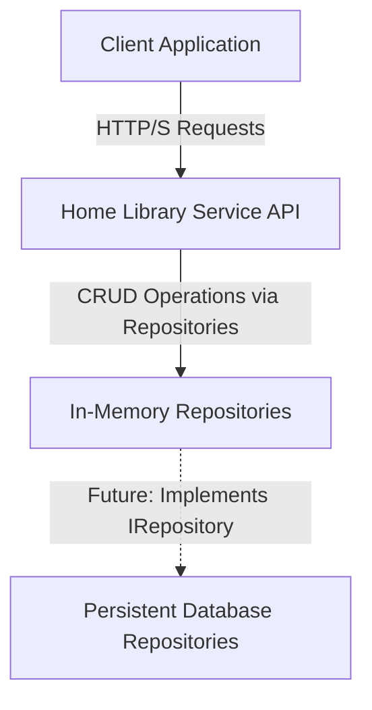
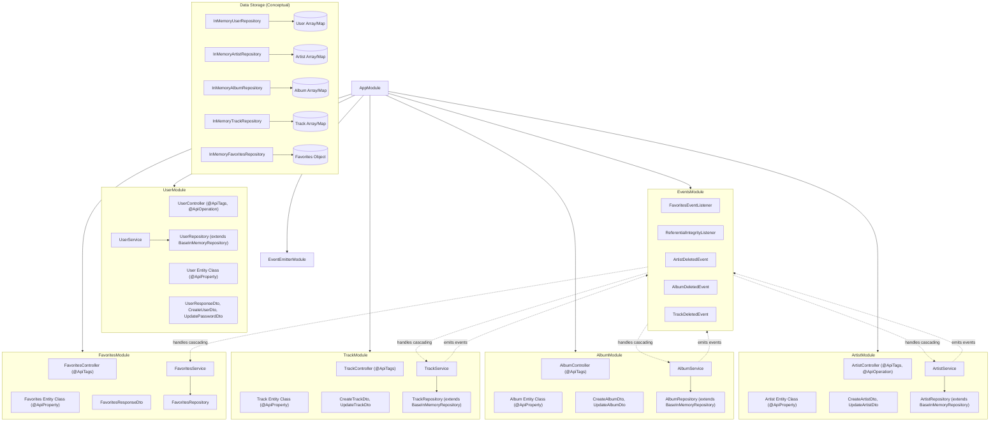
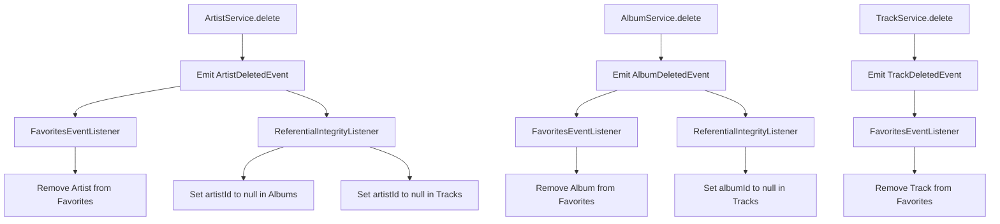

# System Design Document: Home Library Service

**Version:** 1.4
**Date:** June 3, 2025

## 1. Introduction and Goals

### 1.1 Purpose
This document outlines the system design for the Home Library Service. It details the architecture, components, design decisions, and technical considerations for building a RESTful API service that allows users to manage their personal collection of music (artists, albums, tracks) and maintain a list of favorites.

### 1.2 Scope
The system will provide REST API endpoints for managing the following resources:
*   Users
*   Artists
*   Tracks
*   Albums
*   Favorites

The initial implementation will use an in-memory data store, accessed via a repository pattern, with the design accommodating a future transition to a persistent database.

### 1.3 Goals
*   Develop a robust and maintainable REST API service.
*   Adhere to the functional requirements specified in [`/.kilocode/rules/project-requirements.md`](/.kilocode/rules/project-requirements.md).
*   Follow best practices for software architecture and development as outlined in [`/.kilocode/rules/comprehensive-guide.md`](/.kilocode/rules/comprehensive-guide.md).
*   Ensure the system is testable, with a clear strategy for unit, integration, and end-to-end testing.
*   Provide comprehensive API documentation using NestJS OpenAPI (Swagger) tools. The implementation includes both manually crafted documentation ([`doc/api.yaml`](./doc/api.yaml)) and auto-generated specifications ([`doc/api-generated.yaml`](./doc/api-generated.yaml)) from code annotations.

### 1.4 Non-Goals
*   User Interface (UI) development.
*   Implementation of a persistent database in the initial phase (though the design will facilitate this via the repository pattern).
*   User authentication and authorization mechanisms (out of scope for this design iteration).
*   Advanced features beyond the specified CRUD operations and favorites management (e.g., music streaming, recommendations).

## 2. Constraints

### 2.1 Technical Constraints
*   **Programming Language:** TypeScript
*   **Framework:** NestJS (v10.x as per [`package.json`](/package.json))
*   **Node.js Version:** >=22.14.0 (as per [`package.json`](/package.json))
*   **Data Storage:** In-memory for the initial phase, accessed via repository interfaces.
*   **API Style:** RESTful, using JSON for request/response bodies.
*   **ID Generation:** UUID v4 for all entities.

### 2.2 Conventions
*   **Code Style:** Defined by [`.prettierrc`](/.prettierrc) and enforced by Prettier. Key rules include single quotes, trailing commas (all), 2-space tab width, 120 print width, and explicit semicolons. These align with [`/.kilocode/rules/code-style.md`](/.kilocode/rules/code-style.md).
*   **Linting:** Defined by [`.eslintrc.js`](/.eslintrc.js) and enforced by ESLint, integrated with Prettier.
*   **API Documentation:** OpenAPI v3. The system utilizes `@nestjs/swagger@8.1.1` with comprehensive API documentation including:
    - Auto-generated schemas from entity classes using `@ApiProperty` decorators
    - Controller documentation with `@ApiOperation`, `@ApiResponse`, and `@ApiParam` decorators
    - Interactive Swagger UI available at `http://localhost:4000/doc`
    - Generated specifications saved to [`doc/api-generated.yaml`](./doc/api-generated.yaml) and [`doc/api-generated.json`](./doc/api-generated.json)
    - NestJS CLI plugin configured for automatic schema introspection
*   **Port:** Default to 4000, configurable via `.env` file.

## 3. System Scope and Context

### 3.1 Business Context
The Home Library Service aims to provide users with a digital way to catalog their music collection and manage their favorite artists, albums, and tracks. (Note: "User-specific" favorites are simplified to a global collection in this iteration due to auth being out of scope).

### 3.2 Technical Context
The system is a backend REST API service. It will be consumed by clients (e.g., web applications, mobile apps, testing tools) via HTTP.



### 3.3 External Interfaces
*   **HTTP/S:** The primary interface for clients to interact with the API.

## 4. Solution Strategy (Architecture Overview)

### 4.1 Chosen Approach
The system will be implemented as a monolithic application using the NestJS framework. This approach is suitable for the current scope and allows for a well-organized, modular codebase. The architecture will follow the principles of **Layered Architecture** and **Domain-Driven Design (DDD)** at a module level. Data access will be managed using the **Repository Pattern**.

### 4.2 Key Architectural Decisions
*   **Modular Design:** Each resource (User, Artist, Track, Album, Favorites) will be implemented as a separate NestJS module, promoting **Separation of Concerns** and **Single Responsibility Principle**.
*   **Service Layer:** Business logic will reside in service classes within each module. Services will interact with repositories for data operations.
*   **Repository Layer:** An abstraction for data access. Each entity will have a repository interface (e.g., `IUserRepository`) and an in-memory implementation (e.g., `InMemoryUserRepository`). A base repository (`BaseInMemoryRepository`) is provided in `common/repositories/base.repository.ts` which uses centralized UUID generation utilities from `common/utils/uuid.utils.ts`. This promotes the **Dependency Inversion Principle**.
*   **Controllers:** Handle incoming HTTP requests, delegate to services, and manage responses.
*   **Data Transfer Objects (DTOs):** Used for request validation (`class-validator`, `class-transformer`) and structuring response data.
*   **Error Handling:** Consistent error responses with appropriate HTTP status codes as defined in the requirements. NestJS built-in exception filters will be leveraged.
*   **Event-Driven Architecture:** Implement cascading operations using NestJS EventEmitter2 to eliminate circular dependencies between modules. Services emit domain events when entities are deleted, and event listeners handle the cascading updates independently.
*   **API Documentation Strategy:** Comprehensive OpenAPI v3 documentation using `@nestjs/swagger` with:
    - Entity classes (`.entity.ts`) with `@ApiProperty` decorators for automatic schema generation
    - Controller methods annotated with `@ApiOperation`, `@ApiResponse`, and `@ApiParam` decorators
    - DTO validation schemas automatically introspected by NestJS CLI plugin
    - Generated specifications accessible via `/doc-json` endpoint and saved to `doc/` folder
    - Interactive Swagger UI for API exploration and testing

### 4.3 Technologies
*   **Backend Framework:** NestJS 10.x
*   **Language:** TypeScript 5.x
*   **Runtime Environment:** Node.js >=22.14.0
*   **Data Validation:** `class-validator`, `class-transformer`
*   **Password Hashing:** `bcrypt` (for User entity)
*   **ID Generation:** `uuid`
*   **Event System:** `@nestjs/event-emitter` (EventEmitter2)
*   **Testing:** Jest, Supertest
*   **Linting/Formatting:** ESLint, Prettier
*   **API Documentation & Generation:** `@nestjs/swagger@8.1.1` with CLI plugin integration

## 5. Building Block View (Core Components)

The application will be structured into several modules:



### 5.1 Module Descriptions

*   **`AppModule` ([`src/app.module.ts`](/src/app.module.ts)):** The root module, importing all other feature modules and global configurations.
*   **`UserModule`:**
    *   **Responsibilities:** Manages user data (CRUD), including password updates and proper password exclusion from responses.
    *   **Components:** `UserController` (with comprehensive Swagger decorators), `UserService`, `User` entity class, DTOs (`CreateUserDto`, `UpdatePasswordDto`, `UserResponseDto`), `UserRepository`.
    *   **API Documentation:** Full @ApiOperation, @ApiResponse, and @ApiParam decorators implemented.
*   **`ArtistModule`:**
    *   **Responsibilities:** Manages artist data (CRUD) with cascading delete support.
    *   **Components:** `ArtistController` (with comprehensive Swagger decorators), `ArtistService`, `Artist` entity class, DTOs, `ArtistRepository`.
    *   **API Documentation:** Full @ApiOperation, @ApiResponse, and @ApiParam decorators implemented.
*   **`AlbumModule`:**
    *   **Responsibilities:** Manages album data (CRUD). Handles relationships with Artists and cascading operations.
    *   **Components:** `AlbumController`, `AlbumService`, `Album` entity class, DTOs, `AlbumRepository`.
*   **`TrackModule`:**
    *   **Responsibilities:** Manages track data (CRUD). Handles relationships with Artists and Albums and cascading operations.
    *   **Components:** `TrackController`, `TrackService`, `Track` entity class, DTOs, `TrackRepository`.
*   **`FavoritesModule`:**
    *   **Responsibilities:** Manages a global list of favorites (artists, albums, tracks) with automatic cleanup.
    *   **Components:** `FavoritesController`, `FavoritesService`, `Favorites` entity class, `FavoritesResponseDto`, `FavoritesRepository`.
*   **`EventsModule`:**
    *   **Responsibilities:** Handles domain events and cascading operations to eliminate circular dependencies.
    *   **Components:** `FavoritesEventListener`, `ReferentialIntegrityListener`, domain event classes (event interfaces are defined in `common/services/event.service.ts` as `ArtistDeletedEvent`, `AlbumDeletedEvent`, `TrackDeletedEvent`).

### 5.2 Data Models (Entity Classes)
All entities are implemented as TypeScript classes with `@ApiProperty` decorators for automatic Swagger schema generation:

*   **`User` (`src/user/entities/user.entity.ts`)**: 
    - Properties: `id`, `login`, `password`, `version`, `createdAt`, `updatedAt`
    - Password field marked with `writeOnly: true` for proper API documentation exclusion
*   **`Artist` (`src/artist/entities/artist.entity.ts`)**: 
    - Properties: `id`, `name`, `grammy`
    - Includes comprehensive examples and descriptions
*   **`Album` (`src/album/entities/album.entity.ts`)**: 
    - Properties: `id`, `name`, `year`, `artistId` (nullable)
    - Proper nullable field documentation for optional artist relationships
*   **`Track` (`src/track/entities/track.entity.ts`)**: 
    - Properties: `id`, `name`, `artistId` (nullable), `albumId` (nullable), `duration`
    - Duration documented with proper units (seconds)
*   **`Favorites` (`src/favorites/entities/favorites.entity.ts`)**: 
    - Properties: `artists` (array of artist IDs), `albums` (array of album IDs), `tracks` (array of track IDs)
    - Represents a single, global collection in this iteration

**Note:** Legacy `*.interface.ts` files have been removed as entity classes now serve both typing and API documentation purposes.

## 6. Runtime View

### 6.1 Key Runtime Scenarios

*   **User Creation:**
    1.  Client sends `POST /user` with `CreateUserDto`.
    2.  `UserController` validates DTO.
    3.  `UserService` hashes password, prepares `User` data.
    4.  `UserService` calls `userRepository.create()` to store the user.
    5.  `UserService` returns new user (password excluded).

*   **Adding a Track to Favorites:**
    1.  Client sends `POST /favs/track/:id`.
    2.  `FavoritesController` receives request.
    3.  `FavoritesController` calls `FavoritesService` to add track ID.
    4.  `FavoritesService` checks if track exists via `trackRepository.findById()`.
    5.  If track exists, its ID is added to the `Favorites` data via `favoritesRepository.addTrack()`.
    6.  Response sent as per requirements.

*   **Artist Deletion with Cascading Operations (Event-Driven):**
    1.  Client sends `DELETE /artist/:id`.
    2.  `ArtistController` receives request.
    3.  `ArtistService` validates artist exists and deletes it via `artistRepository.delete()`.
    4.  `ArtistService` emits `ArtistDeletedEvent` using `EventEmitter2`.
    5.  `FavoritesEventListener` receives event and removes artist from favorites.
    6.  `ReferentialIntegrityListener` receives event and sets `artistId` to `null` in related albums and tracks.
    7.  Response sent as per requirements.

### 6.2 Event Flow Architecture



### 6.2 Data Flow
Data flows from client requests through Controllers, which delegate to Services. Services use Repository interfaces for business logic and data manipulation. Concrete in-memory repository implementations interact with the data stores. Responses are formatted before being sent back to the client.

## 7. Deployment View

### 7.1 Build and Run
*   **Build:** `npm run build` (compiles TypeScript to JavaScript in `dist` directory).
*   **Run (Development):** `npm run start:dev`.
*   **Run (Production):** `npm run start:prod`.
*   The application listens on port 4000 by default (configurable via `PORT` in `.env`).

### 7.2 Environment Configuration
Managed via `.env` file. Key variables (excluding auth-specific ones for now as per user feedback):
*   `PORT`
*   `CRYPT_SALT` (for user password hashing)
*   Other JWT related variables (`JWT_SECRET_KEY`, etc.) are present in [`.env.example`](/.env.example) but their usage is out of scope for this design iteration.

## 8. Cross-cutting Concepts

### 8.1 Error Handling
*   Use NestJS built-in HTTP exceptions.
*   Status codes will strictly follow the requirements.

### 8.2 Validation
*   Request body validation using DTOs with `class-validator` and `class-transformer`.
*   UUID validation for path parameters using `UuidValidationPipe` which leverages centralized UUID utilities (`common/utils/uuid.utils.ts`).
*   Validation of required fields.

### 8.3 Security
*   **Password Hashing:** `bcrypt` will be used for user passwords.
*   **Data Exclusion:** User passwords must be excluded from API responses (`@Exclude()` in `UserResponseDto` and `writeOnly: true` in entity class).
*   Authentication and Authorization are out of scope for this iteration.

### 8.4 Data Storage (In-Memory with Repository Pattern)
*   Each entity type has a concrete repository implementation extending `BaseInMemoryRepository<T>`.
*   Repositories manage data in arrays or `Map` objects within memory.
*   The `FavoritesRepository` manages a single global `Favorites` object.
*   **Referential Integrity:** Logic for cascading updates (e.g., setting `artistId` to `null` in tracks/albums when an artist is deleted, removing from favorites) is handled via event-driven architecture using NestJS EventEmitter2. Services emit domain events when entities are deleted, and dedicated event listeners handle the cascading operations independently, eliminating circular dependencies.

### 8.5 API Documentation
*   **Swagger Integration:** Comprehensive OpenAPI documentation using `@nestjs/swagger@8.1.1`
*   **Entity Documentation:** All entity classes use `@ApiProperty` decorators with examples, descriptions, and proper type information
*   **Controller Documentation:** Controllers use `@ApiOperation`, `@ApiResponse`, and `@ApiParam` decorators for complete endpoint documentation
*   **Generated Specifications:** API specifications are auto-generated and saved to:
    - `doc/api-generated.json` - JSON format for programmatic access
    - `doc/api-generated.yaml` - YAML format for human readability
*   **Interactive Documentation:** Swagger UI available at `http://localhost:4000/doc` for API exploration and testing
*   **CLI Plugin Integration:** NestJS CLI plugin configured in `nest-cli.json` for automatic schema introspection

### 8.6 Logging
*   Utilize NestJS's built-in `Logger`.

## 9. Design Decisions

*   **NestJS Framework:** Chosen for its structure, TypeScript support, and features.
*   **Repository Pattern for Data Access:** Provides abstraction for data operations, facilitating future DB integration and improving testability.
*   **In-Memory Storage (Initial):** Meets current requirements, implemented via repositories extending `BaseInMemoryRepository<T>`.
*   **UUIDs for IDs:** As per requirements, with centralized UUID utilities.
*   **Modular Structure by Resource:** Enhances maintainability and follows NestJS best practices.
*   **Entity Classes over Interfaces:** Using `.entity.ts` classes with `@ApiProperty` decorators enables both type safety and automatic API documentation generation.
*   **Comprehensive API Documentation:** Full Swagger integration provides interactive documentation and maintains consistency with manual specifications.
*   **Event-Driven Cascading Operations:** Eliminates circular dependencies while maintaining data integrity through automated event handling.

## 10. Quality Requirements

*   **Maintainability:** Achieved through modular design, repository pattern, clean code principles, and documentation.
*   **Reliability:** Ensured by robust error handling, input validation, and fulfilling specified data integrity rules.
*   **Testability:** Services and repositories will be unit-testable. E2E tests for API endpoints.
*   **Security (Limited Scope):** Password hashing is included. Full auth/authz is out of scope.
*   **Performance:** Adequate for in-memory.

## 11. Risks and Technical Debt

*   **In-Memory Data Persistence:** Data loss on restart (known limitation).
*   **Scalability of In-Memory Store:** Not suitable for production with large data.
*   **Global Favorites:** The `Favorites` entity is currently global due to authentication being out of scope. In a typical application, favorites would be user-specific. This is a simplification for the current phase.
*   **Cascading Deletes Complexity:** Mitigated by event-driven architecture that separates concerns and eliminates circular dependencies.

## 12. Testing Strategy

The project has an existing `test` directory and Jest configuration. STRICTLY: existing tests should not be modified. They will be used to evaluate the implementation.
The existing `test` directory structure will be used. Scripts like `test:auth` and `test:refresh` in [`package.json`](/package.json) will be used later. for now we will focus on tests from the root `test` directory.

## 13. Data Flow and Storage (Reiteration with Repositories)

*   **Data Models:** As defined in section 5.2.
*   **Storage Mechanism:** Services use repository interfaces. In-memory repositories manage data arrays/maps.
    ```typescript
    // Example InMemoryUserRepository
    // export class InMemoryUserRepository implements IUserRepository {
    //   private readonly users: User[] = [];
    //   async create(createUserDto: CreateUserDto): Promise<User> { /* ... */ }
    //   // ... other CRUD methods
    // }
    ```
*   **Data Flow on Create (e.g., POST /artist):**
    1.  HTTP Request to `ArtistController`.
    2.  DTO validation.
    3.  `ArtistController` calls `artistService.create(dto)`.
    4.  `ArtistService` calls `artistRepository.create(data)` which adds to the in-memory store.
    5.  `ArtistService` returns the new artist.
    6.  `ArtistController` sends HTTP 201 response.
*   **Data Flow on Read (e.g., GET /favs):**
    1.  HTTP Request to `FavoritesController`.
    2.  `FavoritesController` calls `favoritesService.getFavorites()`.
    3.  `FavoritesService` calls `favoritesRepository.findAll()` to get favorite IDs.
    4.  `FavoritesService` then fetches full entities using `artistRepository.findById()`, `albumRepository.findById()`, `trackRepository.findById()` for each ID.
    5.  `FavoritesService` constructs `FavoritesResponse`.
    6.  `FavoritesController` sends HTTP 200 response.

## 14. External Prod/Dev Dependencies and Tool Configurations
(This section remains largely the same as in Version 1.0, as the core tools and dependencies are unchanged by the internal architectural decision to use repositories and defer auth.)

### 14.1 Production Dependencies (from [`package.json`](/package.json)):
*   `@nestjs/common`, `@nestjs/core`, `@nestjs/platform-express`
*   `@nestjs/jwt` (Presence noted, but direct usage deferred)
*   `@nestjs/mapped-types`
*   `bcrypt`
*   `class-transformer`, `class-validator`
*   `dotenv`
*   `http-status-codes`
*   `reflect-metadata`
*   `rimraf`
*   `rxjs`
*   `uuid`
*   `@nestjs/swagger` (for OpenAPI documentation generation and serving Swagger UI)
*   `@nestjs/event-emitter` (for event-driven architecture and cascading operations)

### 14.2 Development Dependencies (from [`package.json`](/package.json)):
*   `@nestjs/cli`, `@nestjs/schematics`, `@nestjs/testing`
*   `@types/*`
*   `@typescript-eslint/eslint-plugin`, `@typescript-eslint/parser`, `eslint`, `eslint-config-prettier`, `eslint-plugin-prettier`
*   `cross-env`
*   `jest`, `ts-jest`, `supertest`
*   `prettier`
*   `source-map-support`
*   `ts-loader`, `ts-node`, `tsconfig-paths`, `typescript`

### 14.3 Tool Configurations:
*   **TypeScript ([`tsconfig.json`](/tsconfig.json))**
*   **NestJS CLI ([`nest-cli.json`](/nest-cli.json))**
*   **Jest ([`jest.config.json`](/jest.config.json))**
*   **ESLint ([`.eslintrc.js`](/.eslintrc.js))**
*   **Prettier ([`.prettierrc`](/.prettierrc))**
*   **Environment ([`.env.example`](/.env.example))** (Noting JWT variables are present but usage deferred).